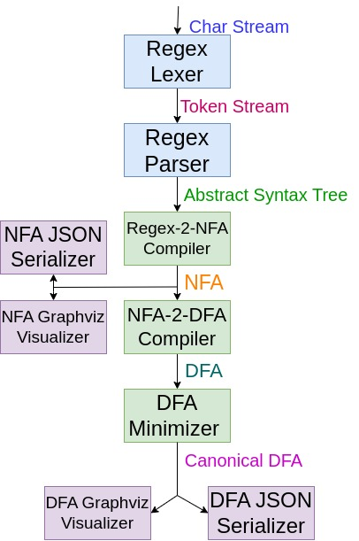
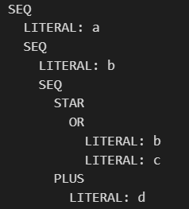
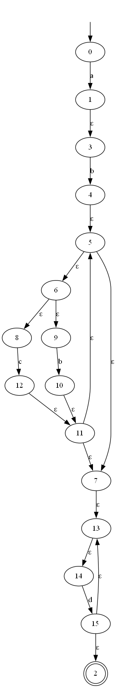
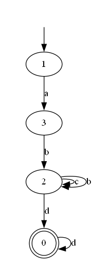

# Regex to NFA and DFA
The Regex to NFA, DFA, and Minimized DFA Converter is a Python program that converts regular expressions into non-deterministic finite automata (NFA), deterministic finite automata (DFA), and minimized deterministic finite automata (Min DFA). The program reads a regular expression and creates an NFA that recognizes the language defined by the regular expression. It then converts the NFA to a DFA, and finally, it minimizes the DFA to create a Min DFA that is equivalent to the original NFA.
## ⚒️ Supported Rules<a name = "features"></a>

- [x] Alteration: The | character can be used to denote alternation between two expressions. For example: A|B.
- [x] Concatenation: Expressions can be concatenated together to form a new expression. For example: AB.
- [x] 1 or More: The + character can be used to indicate that the preceding expression must occur one or more times. For example: A+.
- [x] 0 or More: The * character can be used to indicate that the preceding expression can occur zero or more times. For example: A*.
- [x] Optional: The ? character can be used to indicate that the preceding expression is optional. For example: A?.
- [x] ORing (aka Char/Num classes): Expressions can be ORed together using brackets and the | character to form character or number classes. For example: [ABC] or [345].
- [x] Ranges: Ranges of characters or numbers can be defined using brackets and the - character. For example: [0-9] or [a-z].
- [x] Brackets or Grouping: Expressions can be grouped using parentheses to control the order of operations. For example: (ABD)+.

## 🏁 Get started <a name = "Install"></a>

```
git clone https://github.com/gaserashraf/Regex-to-NFA-DFA.git
```
```
cd Regex-to-NFA-DFA
```
```
$ pip install graphviz
```
```
run jupyter notebook
```
## 💻 Built using <a name = "tech"></a>
- **python**

## ⚙️ Project pipeline


## 📷 Demo
## For regex: ab(b|c)*d+
<div name="Screenshots" >
   <h2>AST:</h2>
   </a>
   <hr>
   <h2>NFA:</h2>
   </a>
   <hr>
   <h2>DFA:</h2>
   </a>
   <hr>

   <h2>Minimized DFA:</h2>
   </a>
</div>
